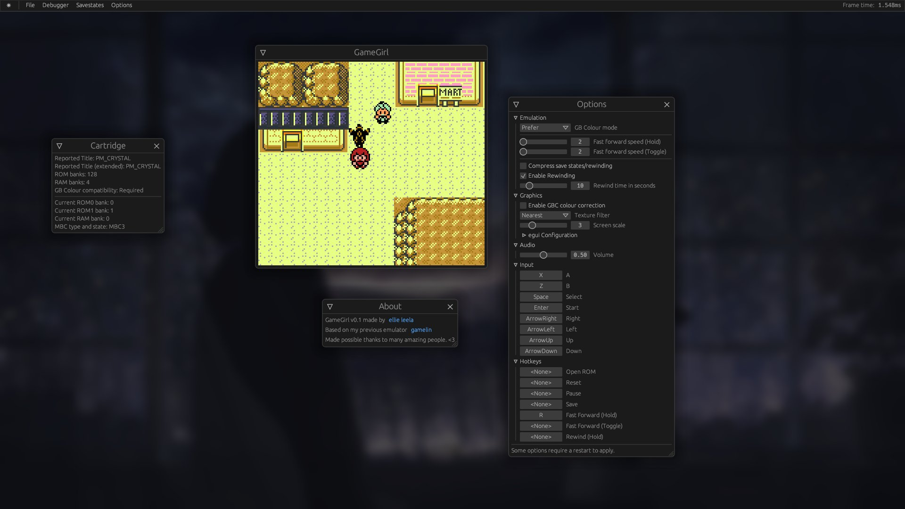
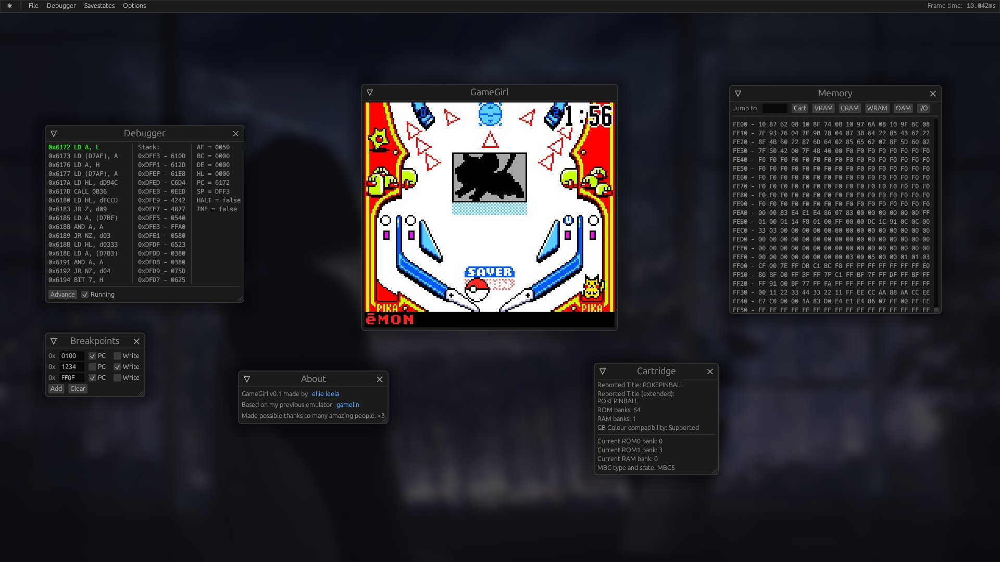
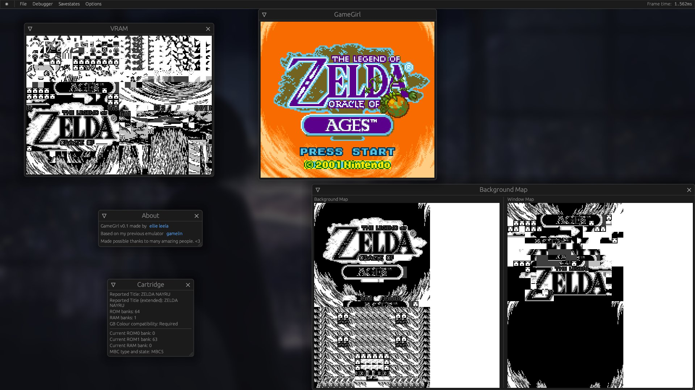

# GameGirl
A Gameboy (Color) emulator written in Rust, rewrite of [gamelin](https://git.angm.xyz/ellie/gamelin).


## Status
The emulator is in a good and usable state. Both DMG and CGB emulation is complete and quite accurate, 
enough to make most commercial games run perfectly.  
A few features are still missing but being worked on.

### Features
- Complete DMG/CGB implementation, including running DMG games on CGB
- Colour correction for CGB
- Highly configurable, including input
- Savegame support in common `.sav` format (Basic RTC support)
- Support for creating and loading save states with "undo last load" function
- Fast forwarding hotkeys, both toggle and hold
- Rewinding support with little memory use (~1MB per second of rewinding at 60fps)
- Debugger with:
    - Line-by-line advance
    - PC and write breakpoints
    - Memory, register and stack view
    - Cartridge Info Viewer
    - Visual debugging tools: VRAM and map viewers
- Automated running of blargg and mooneye tests


## Screenshots
##### Playing Pokemon Crystal Clear

##### Pokemon Pinball with running debugger and memory viewer

##### TLoZ: Oracle of Ages with some visual debugging tools open



## Goals
The main goals of this emulator is to create a nice-to-use emulator with many comfort features that should be able
to run well in the browser. Accuracy is only a goal when it fixes issues encountered
by actual games; implementing complex but ultimately useless hardware details that aren't used by (almost any) games
(like the OAM bug or MBC1 multicarts) is not a goal of this emulator, particularly considering
the speed requirements needed to make it work in the browser.

### Missing console features
- Some MBC3 controllers have a built-in RTC for keeping track of time; gamegirl implements it,
  but in a very simple format incompatible with other emulators that has a high chance of
  not working with most games (it was tested with Pokemon Crystal and successfully kept time
  after turning the game off overnight - needs more testing).
  It is the same format used by Gamelin.


## Build
``` bash
cargo build --release
```


## Testing
Blargg and mooneye ROMs can be run automatically:
```bash
# Release recommended for speed
cargo run -p tests --release
```

### Blargg test results
All tests except for `oam_bug` (which will not be implemented) pass.

### Mooneye test results
- `acceptance`: 30 out of 71 pass
- `emulator-only`: All pass (except MBC1 multicart; will not be supported)

### Acid2
mattcurrie's dmg-acid2 and cgb-acid2 are both corre, including CGB compatibility mode on dmg-acid2.


## Thanks To
- [Imran Nazar, for their series of blog posts on GB emulation](http://imrannazar.com/GameBoy-Emulation-in-JavaScript:-The-CPU)
- [Michael Steil, for The Ultimate Game Boy Talk](https://media.ccc.de/v/33c3-8029-the_ultimate_game_boy_talk)
- [kotcrab, for creating the xgbc emulator I often used to confirm/understand fine behavior](https://github.com/kotcrab/xgbc)
- [stan-roelofs, for their emulator, which I abridged the sound implementation from](https://github.com/stan-roelofs/Kotlin-Gameboy-Emulator)
- [Megan Sullivan, for her list of GB opcodes](https://meganesulli.com/blog/game-boy-opcodes)
- [gbdev.io for a list of useful resources](https://gbdev.io)
- blargg, Gekkio and mattcurie for their test ROMs and retrio for hosting blargg's ROMs
- You, for reading this :)
